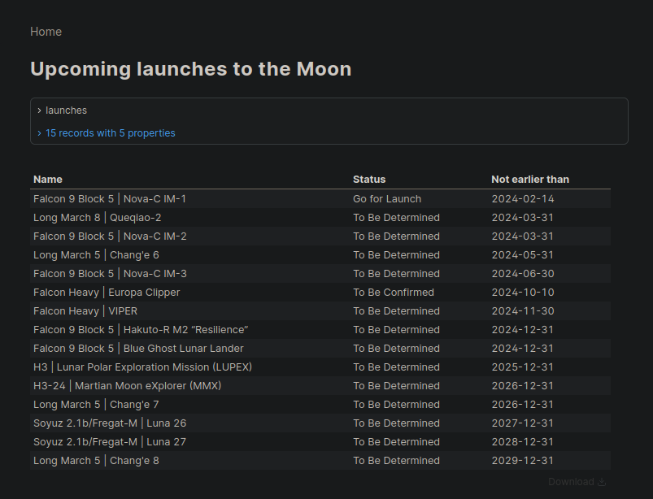

# Raccoon Dashboard 🦝🚀

This project showcases an end-to-end data engineering and hypermodern BI solution built on unstructured data sources. It creates a dashboard for tracking upcoming rocket launches, designed for Mooncoon's Raccoon Engineers to plan their next lunar infiltration.

## Project Overview

This dashboard demonstrates a complete data pipeline:
- Extracting data from unstructured sources (Launch Library 2 API)
- Transforming and loading data using modern data engineering tools
- Presenting insights through a cutting-edge BI layer

It serves as an excellent example of integrating various data engineering and BI technologies to derive value from unstructured data.

## Components

1. **Data Extraction**: Utilizes the Launch Library 2 API to fetch unstructured data on upcoming rocket launches.
2. **Data Loading**: Employs `dlt` to load and structure data into a PostgreSQL database running in Docker.
3. **Data Transformation**: Uses dbt for creating a data mart, optimizing raw data for dashboard queries.
4. **Scheduling**: Implements Dagster for orchestrating the ETL pipeline, ensuring data freshness.
5. **Visualization**: Presents data through an Evidence dashboard, showcasing modern BI capabilities.

## Deployment

### Run Dagster

```bash
docker compose up
```

### Run Evidence

Install [bun](https://bun.sh/), and make sure that your node version complies with [evidence's requirements](https://docs.evidence.dev/guides/system-requirements/#evidence-main-article) ,then run:

```bash
cd evidence && bun install && bun run dev
```

## Usage

After running both Dagster and Evidence, access the dashboard through the URL provided by the Evidence development server. This will display the processed and analyzed rocket launch data in an intuitive, interactive format.

### Enjoy the Eyecandy and Plan the Infiltration!




